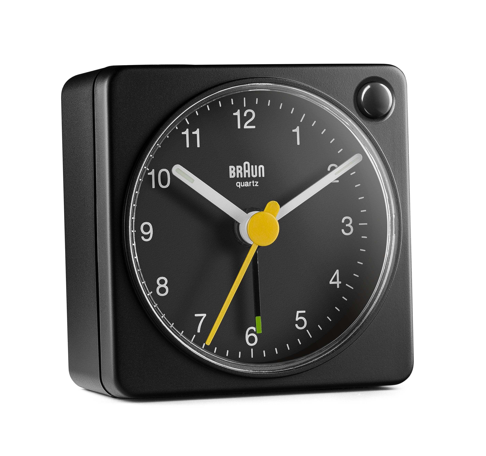
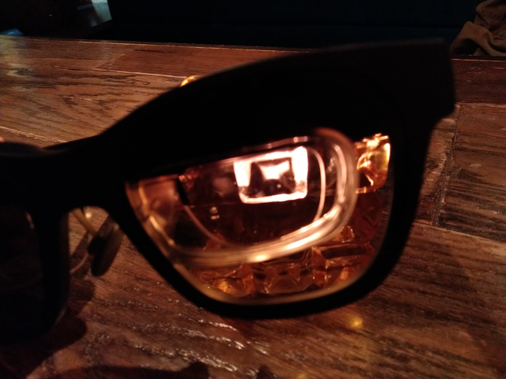
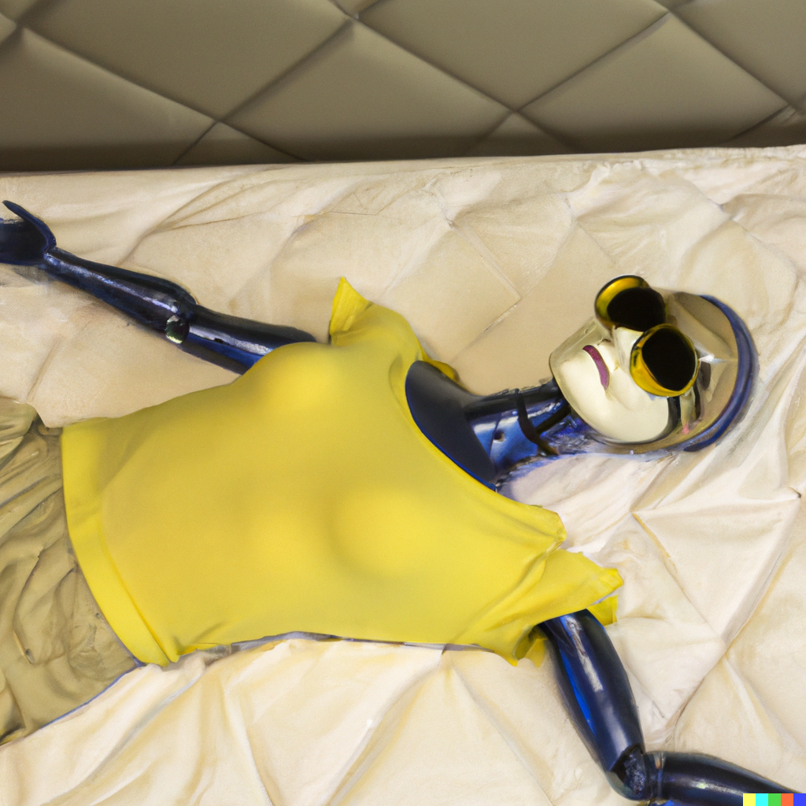
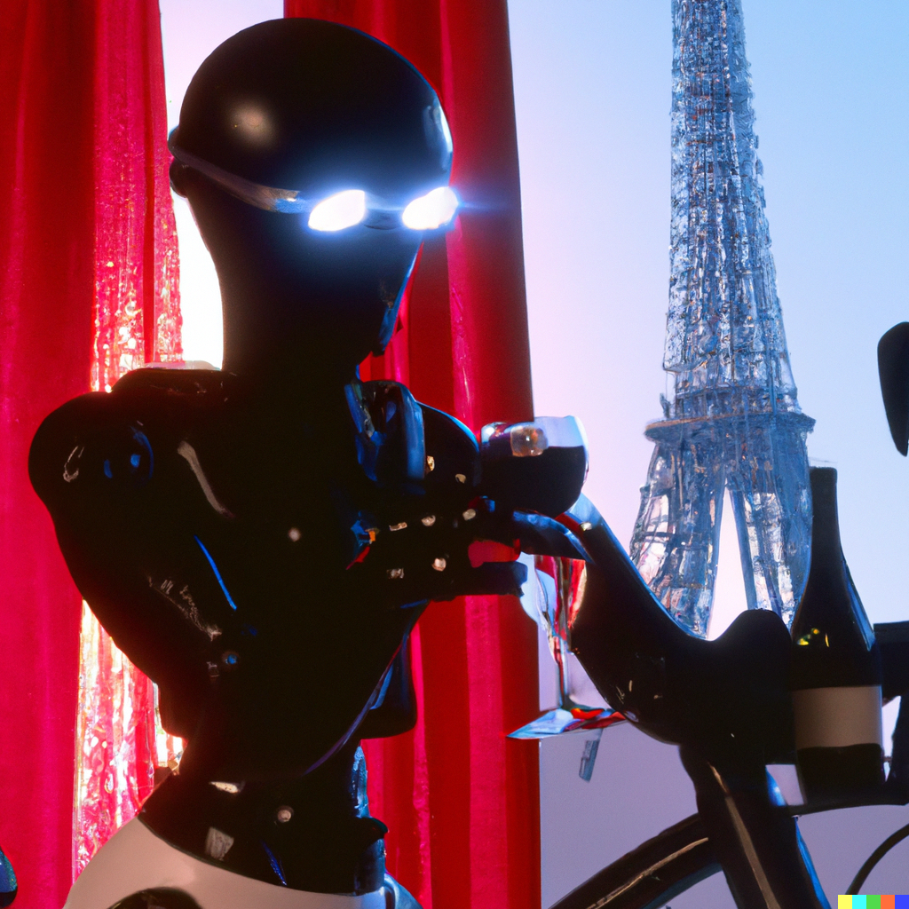
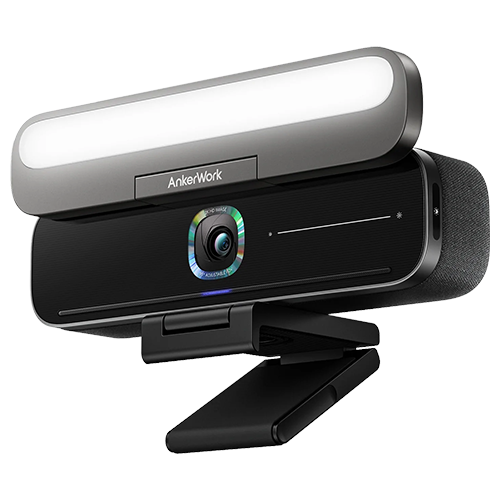

# Reviews for 2022

## A slice of time, and the Braun Classic travel analogue clock

Replica of a classic design. Matched well with eneloop batteries, ~£20.

"... there is something inherently ridiculous about digital watches... Digital watches came along at a time that, in other areas, we were trying to find ways of translating purely numeric data into graphic form so that the information leapt easily to the eye. For instance, we noticed that pie charts and bar graphs often told us more about the relationships between things than tables of numbers did. So we worked hard to make our computers capable of translating numbers into graphic displays. At the same time, we each had the world’s most perfect pie chart machines strapped to our wrists, which we could read at a glance, and we suddenly got terribly excited at the idea of translating them *back* into numeric data, simply because we suddenly had the technology to do it..." -- Douglas Adams, 1992

[A 2022 video](https://www.youtube.com/watch?v=NeopkvAP-ag) from Technology Connections gave me the realisation that digital clocks lack a "progress bar" which was de-facto provided by analogue clocks, basically a convenient pie chart showing the time past and the time to come in an hour. An insightful video, I recommend you take a look. Anyway, this video made me want a decent analogue clock to counteract my disgraceful disrespect for deadlines (I gather that "deadline" is no longer the preferred terminology, readers are encouraged to suggest appropriate alternatives).

In my search, I considered clocks matching the form of those seen used for [Swiss railways](https://en.wikipedia.org/wiki/Swiss_railway_clock). Did you know that Swiss railway clocks have a characteristic pause when they start a new minute? Wikipedia has a visualisation:

I coded up clock displays that appeared on e-ink displays (as seen in my constructed [cyberDeck 2022](https://github.com/wdbm/cyberDeck_2022). That might still be a promising avenue, but I haven't had the time to it in a proper graphical form (the ASCII version just didn't cut it). Deireadh an scéil, I went for a small and classic and cheap (imitation of a) design from Braun.

Has it been a psychological success? Guess it does help, but mostly I like it and feel a bit better with it visible. Maybe you should get an analogue clock too.

## Nreal Air video glasses

In 2014, courtesy of the world's biggest advertiser, I got my hands on a Google Glass headset. Lovely little device with plenty of innovation, including the undersung inbuilt voice recognition. The augmented reality overlay of constellations was genuinely moving. I had in mind back then to be able to walk about while watching documentaries and such -- exercise while catching up on exciting media. Limited resolution (640 by 360 pixels) was one thing, but viewing something with only one eye, and while requiring the wearing of corrective contact lenses, was asking more than the limits of comfort could bear.

Now I have my hands on the [Nreal Air](https://www.nreal.ai/air) video glasses. While these glasses feature technology that enables one to see video in the glasses impacted by moving the head about the neck (such as to view three big virtual computer displays), my main purpose with these was to have a workable and convenient video display in three main scenarios. I am happy to report success with this device for all tested cases.

At time of writing, the only easy-ish way to access these glasses in the UK for a reasonable price is through the sole distributor in the UK called EE, a phone network operator. There is still the absurd situation of the device being inaccessible for purchase on the EE website for people who are not classed by EE as customers. A trip to an EE shop is necessitated, as is convincing the people in the EE shop that this is indeed a device that is sold by EE. You must request that they order one of the devices to the store for collection by you. In my experience this happened within around 3 days. Deposit £25.

I understand that the manufacturers have stopped producing these devices with the need to "activate" them. While in principle this activation procedure should be straightforward via their dedicated website or a compatible phone, in practice I was forced to use Windows to activate it via their dedicated website (which meant popping in a new hard drive, writing the spyware OS etc. -- in contrast to, say, Ubuntu, one should *never* connect to the internet when installing this OS). This is an inconvenient procedure that is asking far too much of users. I hope that what I've heard is true and that this will no longer be necessary shortly.

But following activation, all is golden. These glasses, which are powered solely by USB-C, connect to a laptop with DisplayPort via USB-C on compatible hardware (such as a ThinkPad X390 Yoga). There's a fast, rich, saturated image.

The glasses come with a plastic cover for the front which gives a totally dark background to the video. Without the cover, the video on the glasses is entirely usable, with little compromise for the benefit of visual situational awareness.

I had three goals in mind when getting these things. The first was to be able to see films and such while lying on my back for reasons of comfort. They work well for this purpose, but one realises that a good, perhaps split, keyboard is needed for any work while lying fully on one's back.

While the little (non-private) speakers built into the arms of the glasses are workable, they are tinny, and a pair of proper headphones (which fit just fine over the glasses) is recommended, that or a decent set of speakers. The second goal was to be able to use a laptop on an airline plane. The glasses work perfectly for this. A comfortable, high-quality display with the added benefit of privacy from your fellow airline inmates. The third goal was to see episodes of whatever while on an exercise bike. Again, this is successful, with the small caveat that the necessary cable can be a mild inconvenience.

The glasses, ~£400.

For those without access to to the assumed DisplayPort/USB-C hardware, a type of cable exists to convert a HDMI signal (from more common hardware) to a USB-C DP signal, an example of which is the [Fairikabe HDMI to USB C Adapter Cable](https://www.amazon.com/dp/B0B5XBYQSM) (~$30).

An insert of corrective lenses is provided briskly in the UK by Lensology (~£100). Provide them with your prescription details and they'll send you the lenses already attached to a little frame suited for insertion into the Nreal Air glasses.

## Flipper Zero

|||
|:---:|:---:|

The really really good 1995 cyberpunk film *Johnny Mnemonic* features [spoiler] a cyber-dolphin called Jones. If you were to crowdfund a hacker's Tamagotchi featuring this character, you might get the odd little open-source multi-function pentester device called the [Flipper Zero](https://flipperzero.one). The more you "hack" with this robust and well-constructed device, whether that be by turning off/down bar televisions with its infrared transmitter or by scanning RFID tags, the happier your cyber-dolphin pal gets. Beyond the various pentesting applications, the device naturally features the likes of the snake game and a little chiptunes-style music player.

|||
|:---:|:---:|

It can interact with multiple RFID frequency ranges, Bluetooth, sub-1 GHz radio, USB (including programmable BadUSB pentesting) and infrared, and can interface with iButton keys and via GPIO pins. Replay pentests are available also. The device can connect to a phone for backups and updates.

Ideal for minmimal friendly white-hat chaos and for proving to friends and family that you are a real hacker.
~$169. [Reportedly](https://t.me/zhovner_hub/1824) [there are certain difficulties](https://news.ycombinator.com/item?id=32739950) importing the devices related to sanctions against Russia.

## cyberDeck 2022

|||
|:---:|:---:|

Enthused by my thesis writing, my appreciation of good old ergonomic computer interfaces, and by my desire for a writing machine suited to the sunlight as well as the dark interior of Chinaski's in Glasgow, I constructed the cyberDeck 2022. Read all about it [here](https://github.com/wdbm/cyberDeck_2022). Somehow the thing encourages me to write and it also serves as an excellent conversation piece.

## AnkerWork B600 webcam

Saw this block of a webcam on exhibit at CES 2022. Got one of them early, hoping it would work on Linux, which it did. [Guvcview](https://en.wikipedia.org/wiki/Guvcview) provides access to many of the features of the device, such as cropping.

Very decent quality for a contemporary webcam with video algorithms that result in very little lag for such a high resolution. The camera has intelligence sufficient to allow it to pan a cropped view around its whole field of view to follow a face about. While a headset microphone remains preferable, the inbuilt microphone technology is effective, particularly in counteracting feedback echo effects that can occur using nearby speakers or the usable inbuilt speakers of the microphone.

There is a functional light bar above the camera that doubles as a foldable privacy cover for the lens and there are handy capacitive buttons to mute the microphone and to vary the brightness of the light bar.

Not to be considered a readily portable device, it is certainly good if the aim is good quality video calls.

~€230 at time of writing.

## Anker Power Bank, PowerCore III Elite (25600 mAh, 60 W)

An awkward name, but that aside it is a capable power bank suited to laptops and phones. Low temperatures show a significant impact on performance.

~€100 at time of purchase.

## Lenovo ThinkPad Thunderbolt 3 Dock Generation 2

Today there are various options for devices that enable something like a laptop with the capability of sending DisplayPort signals via USB-C to be hooked up to a dock that is connected to multiple displays. This particular one is relatively cheap and neat and works well with Ubuntu. Can recommend on that basis.

~€195 new at time of writing. Available readily refurbished.

## Tin of five Romeo y Julieta Club King cigars

Keen to support socialism, I donated some funds to the Republic of Cuba in exchange for these smaller Havanos cigars. A fine taste of a medium strength cigar with tobacco leaves sourced from the region of Vuelta Abajo ("the lower roundtrip") at the west of Cuba. Ideal for reenforcing friendships, making new ones, and for obair a dhéanamh in isolation too.

These provided assistance in completing my Ph.D. thesis on experimental particle physics. Something about smoking one of these things at the Thornwood or Sloan's in Glasgow fortified my adopted mental image of a hardened writer, which helped to finish the document.

£109.68 from Robert Graham in Glasgow at time of writing.

## [Book] The Codebreakers: The Comprehensive History of Secret Communication from Ancient Times to the Internet, Revised and Updated, David Kahn, 1997

One of the first attempts at a contemporary a detailed history of cryptography from ancient history to recent times. And since the United States Intelligence Board tried to impede its publication you know it's got to be good.

While I have had an interest in cryptography and wanted to know more, the greater motivation for this purchase (which I have only started to work my way through) was to get a big tome that was reminiscent of the ancient, secretive books and scrolls of old. I had in mind the likes of Johannes Trithemius' Polygraphiae at time of purchase.

The revised and updated version is recommended, as the original version did not include Alan Turing and cryptographic exploits associated with him, work which was still kept secret at the time of original publication.

Price varies. The reader may prefer to get a battered second-hand copy with as many worthwhile scribbles as possible.

## [Book] Invisible Women: Exposing Data Bias in a World Designed for Men, Caroline Criado Perez, 2020

Valentina Tereshkova entered the cosmos in 1963 aboard the Vostok 6 as the first woman in space. It was 1978 before the first American woman, Sally Ride, flew in space. The proximal, stated reason? Space toilets. NASA space toilets were designed with only capitalist schlongs in mind.

Whether it is the dismal length of queues for women's toilets in nightclubs or the seatbelt of my mother's Mercedes B Class being potentially lethal to those of shorter stature, designs throughout the world retain a bias against women, with a range from inconvenience to lethal.

*Invisible Women* is a worthwhile book on an enormous and systemic issue that remains shamefully prevalant pretty much everywhere -- unintentional and intentional misogynistic design.

The back cover description of the book *Invisible Women* is as follows:

"Imagine a world where your phone is too big for your hand, where your doctor prescribes a drug that is wrong for your body, where in a car accident you are 47% more likely to be seriously injured, where every week the countless hours of work you do are not recognised or valued. If any of this sounds familiar, chances are that you're a woman. Invisible Women shows us how, in a world largely built for and by men, we are systematically ignoring half the population. It exposes the gender data gap -- a gap in our knowledge that is at the root of perpetual, systemic discrimination against women, and that has created a pervasive but invisible bias with a profound effect on women's lives. Award-winning campaigner and writer Caroline Criado Perez brings together for the first time an impressive range of case studies, stories and new research from across the world that illustrate the hidden ways in which women are forgotten, and the impact this has on their health and well-being. From government policy and medical research, to technology, workplaces, urban planning and the media, *Invisible Women* reveals the biased data that excludes women. In making the case for change, this powerful and provocative book will make you see the world anew. "

Nicola Sturgeon's review: "Revelatory –- it should be required reading for policy and decision makers everywhere".

## [Book] The Black Jacobins: Toussaint L'Ouverture and the San Domingo Revolution -- C. L. R. James, James Walvin, 1938

"Brothers and friends, I am Toussaint L'Ouverture; perhaps my name has made itself known to you. I have undertaken vengeance. I want Liberty and Equality to reign in St. Domingue. I am working to make that happen. Unite yourselves to us, brothers and fight with us for the same cause."

An account of the first recorded, and perhaps only, major slave revolt that was successful, and a portrait of one of the leaders of the revolt, Toussaint L'Ouverture. A remarkable account of how the oppressed people in the Haitian revolution that was launched in 1791 took the ideals of the French Revolution and utilised them to throw off their oppressors in Santo Domingo, while taking a nuanced view of what it meant to be black in that context, with other people who were viewed as oppressed, such as the Poles, given a form of black status for philosophical and political expediency. Indeed, this nuanced approach appears to have undermined the post-revolutionary attack on Haiti that had been arranged by Napoleon. A book that describes the conditions of slavery on the island, the status of slave-owners, the status of poor white people, and that gives an account of those black and mulatto people who took up arms. A book which not only talks about the anti-slavery ideals, but also describes the deeply considered tactical ideology of the L'Ouverture forces.

## [Book] The Epic of Gilgamesh (Penguin Classics), Nancy Sandars, 1973

A classic and ancient major piece of human literature. It is a set of stories of the king Gilgamesh, a sort of demi-god, and his wild comrade Enkidu, trying to engage with and understand the world. It has some of the most ancient allegories and tropes known. It appears that the Bible replicates stories from the Epic of Gilgamesh, particularly the flood story, together with various other elements.

Much of the copy of the book I have, by the remarkable Nancy Sandars, features a history that attempts to provide a historical context for the story. I gather that there are some flaws with this particular background known today but some good context is likely better than nothing when dealing with a story so ancient.

A highlight for me was not noting a different account of the flood from that seen in the Bible, and I was laughing at Gilgamesh travelling to the end of the world and then getting advices from a wine-maker at the end of the world. We have all been there.

The story is remarkably relatable and moving and is rich in allegory and depictions of the love between Gilgamesh and Enkidu.

## [Book] We're Going on a Bear Hunt, Michael Rosen, Helen Oxenbury, 1989

A couple of friends had their first child recently and, aside from using DALLE-2 to generate/author a childrens' book along with other pals (*Where is the MacGuffin?*, available [here](https://github.com/wdbm/Where_is_the_MacGuffin)), I made sure to get them a copy of the wonderful book *We're Going on a Bear Hunt*. It has simple graphics that work well for a childrens' book and it has simple humour. It also has time-honoured repetition of joyously-sung-out choruses, something we see as a feature of even the ancient epic of Gilgamesh. But what sets it above the rest is the hilarious irony in the story. The irony is hopefully accessible to the child, but at least the parents get a laugh.

Features sing-song refrains that lead to a humourous anticipated ironic conclusion.

## [Book] Small Architecture, Philip Jodidio, 2014

Get the hardcover version. A nice book of small habitations, the like of which you might see on [Dezeen](https://www.dezeen.com).

If you're in a small apartment, this conversation piece can encourage you to tidy the place to make it (at least in your mind) reflect those small spaces seen in the book. For your guests in your horribly tiny apartment the book can encourage them to enjoy the space as some artistic architectural exhibit.

## [Book] English as She Is Spoke (McSweeneys Books, 2002)

A version of the classic and hilarious example of machine translation. I'm not entirely convinced that this particular version is the best edition possible. The absurdity of the poor translation is perhaps brought forth most effectively with a listing only of the English words. However this edition is hardback and attractive and gives all the English words alongside the Portuguese which gives insight into how the errors happened.

But should we be able to see into the mind of the machine that produced this fine work of artistic humour?

## [Book] Roadside Picnic, Boris Strugatsky & Arkady Strugatsky, 1972

I got the book following the beaming of *Hypernormalisation* by Adam Curtis into my brain, and following viewing the 2018 film *Annihilation* directed by Alex Garland.

To me, the 2019 film *The Color Out of Space* directed by Richard Stanley is more hilarious comedy than horror. I have to say that I read Roadside Picnic with that vibe. I think its view of that which is alien in the world of the book is so worthwhile, but also its rollocking pace and nasty characters and familiarity with strangeness somehow adds to the humour for me. Decent world-building too for such a short book.

## [Book] Lifespan: Why We Age – and Why We Don’t Have To, David A. Sinclair, 2019

There's a long history on the sale of snakeoil, and an obvious caveat is that this offering may be more of the same. But the reversal of significant aspects of aging in mice by the writer and associates gives a hint that the author may have at least some answers to the questions of how to cure aging and how to improve the quality of life while we have it.

Lots of good information and suggestions in the book, but featuring some obvious padding, including anecdotes and economics. Perhaps a punchline is a conclusion section where he mentions his own regimen: 1 g NMN, 1 g resveratrol, Vitamin D, K2, 83 mg aspirin, avoid sugar, bread, pasta, skip one meal a day, get your blood tested, don't smoke, avoid plastic, excessive UV exposure, X-Rays, CT scans, sleep in a cold bedroom, do cold exposure, do exercise. Broad suggestions are to eat once per day, exercise, take metformin, resveratrol and NMN.

~£15 for the hardcover.

## [Book] Xi Jinping: The Governance of China (volume 1, 2014)

A superb book that offers the reader significant insights into the proper governance of China. Xi Jinpin has done it again.

An attractive hardcover book available for ~€19 at time of writing.

(And on a less tongue-in-cheek note, it is interesting to read propaganda that does *not* support the view that economic growth is necessarily a benefit.)

